<!-- flag{r34d_th3_s0urc3_luk3} -->

<div align="center">



```
root@yami02:~# whoami
uid=0(yami02)  gid=1337(elite)  loc=BH/MG/BR  mode=OFFENSIVE
「敵を知り、己を知れば、百戦危うからず」— 孫子
```

</div>

---

**Offensive Security · Malware Analysis · CTF**


`Nmap` `Metasploit` `Burp Suite` `IDA Pro` `GDB/pwndbg` `Hashcat` `OSINT` `HTB` `pwn.college`

---

<div align="center">


</div>

---

<div align="center">

</div>

<!-- flag{k33p_hunt1ng_c3rts} -->
<!-- ZmxhZ3toNGNrX3RoM19wbDRuM3R9 -->
